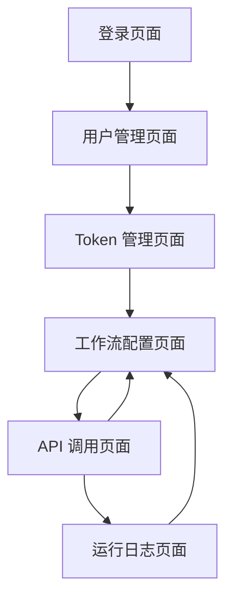

# Coze API 转换服务 - 产品需求文档

## 1. 产品概述

Coze API 转换服务是一个中间件平台，将 Coze 工作流 API 转换为更灵活、易用的函数服务形式，支持多种请求方式和数据格式转换。

- 解决 Coze 工作流 API 调用复杂、格式固定的问题，为开发者提供更灵活的 API 调用方式
- 目标用户：需要集成 Coze 工作流的开发者和企业用户，简化 API 集成流程，提高开发效率

## 2. 核心功能

### 2.1 用户角色

| 角色 | 注册方式 | 核心权限 |
|------|----------|----------|
| 管理员 | 系统预设账号 | 管理所有用户、查看系统统计、配置系统参数 |
| 普通用户 | 用户名密码注册 | 管理个人 Token、配置工作流、查看运行日志 |

### 2.2 功能模块

我们的 Coze API 转换服务包含以下主要页面：

1. **登录页面**：用户身份验证、密码找回功能
2. **用户管理页面**：用户注册、个人信息管理、密码修改
3. **Token 管理页面**：添加、删除、查看 Coze API Token
4. **工作流配置页面**：创建、编辑、删除工作流配置，设置请求参数和响应格式
5. **API 调用页面**：测试工作流 API、查看调用结果
6. **运行日志页面**：查看工作流运行历史、统计分析

### 2.3 页面详情

| 页面名称 | 模块名称 | 功能描述 |
|----------|----------|----------|
| 登录页面 | 用户认证 | 用户名密码登录、记住登录状态、密码找回链接 |
| 用户管理页面 | 个人信息管理 | 查看编辑个人信息、修改密码、账户安全设置 |
| Token 管理页面 | Token 列表 | 显示所有 Token、添加新 Token、删除无效 Token |
| Token 管理页面 | Token 操作 | 添加 Token 表单、Token 有效性验证、使用统计 |
| 工作流配置页面 | 配置列表 | 显示所有工作流配置、搜索筛选、批量操作 |
| 工作流配置页面 | 配置编辑器 | 工作流 ID 设置、参数配置、请求方式选择、响应格式定义 |
| API 调用页面 | 接口测试 | 选择工作流、输入参数、发送请求、查看响应结果 |
| API 调用页面 | 结果展示 | JSON 格式化显示、错误信息提示、调用统计 |
| 运行日志页面 | 日志列表 | 按时间排序显示日志、筛选条件、分页显示 |
| 运行日志页面 | 日志详情 | 详细调用信息、错误堆栈、性能指标 |

## 3. 核心流程

**普通用户流程：**
用户首先在登录页面进行身份验证，登录成功后进入用户管理页面查看个人信息。然后在 Token 管理页面添加 Coze API Token，接着在工作流配置页面创建和配置工作流参数。配置完成后可以在 API 调用页面测试工作流，最后在运行日志页面查看调用历史和统计信息。

**管理员流程：**
管理员登录后可以访问所有用户的配置和日志信息，进行系统级别的管理和监控。

## 4. 用户界面设计

### 4.1 设计风格

- **主色调**：蓝色系 (#1890ff) 作为主色，灰色系 (#f5f5f5) 作为背景色
- **按钮样式**：圆角按钮，主要按钮使用蓝色背景，次要按钮使用白色背景蓝色边框
- **字体**：中文使用微软雅黑，英文使用 Roboto，主要字号 14px，标题字号 16-20px
- **布局风格**：卡片式布局，左侧导航栏，顶部面包屑导航
- **图标风格**：使用 Ant Design 图标库，简洁现代的线性图标

### 4.2 页面设计概览

| 页面名称 | 模块名称 | UI 元素 |
|----------|----------|---------|
| 登录页面 | 登录表单 | 居中卡片布局，蓝色渐变背景，白色表单卡片，圆角输入框，蓝色登录按钮 |
| 用户管理页面 | 信息展示 | 左侧头像区域，右侧信息表单，编辑按钮，保存取消按钮组 |
| Token 管理页面 | Token 列表 | 表格布局，添加按钮，操作列（编辑/删除），状态标签（有效/无效） |
| 工作流配置页面 | 配置表单 | 分步骤表单，JSON 编辑器，预览区域，保存按钮 |
| API 调用页面 | 测试界面 | 左右分栏，左侧参数输入，右侧结果展示，发送按钮 |
| 运行日志页面 | 日志表格 | 时间筛选器，状态筛选，分页表格，详情弹窗 |

### 4.3 响应式设计

产品采用桌面优先设计，支持移动端适配。在移动端，侧边导航栏收缩为汉堡菜单，表格转换为卡片式布局，优化触摸交互体验。