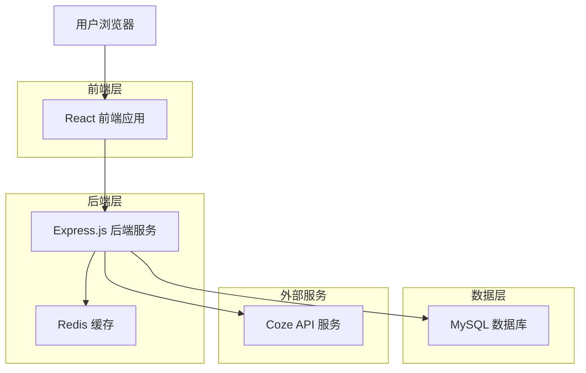
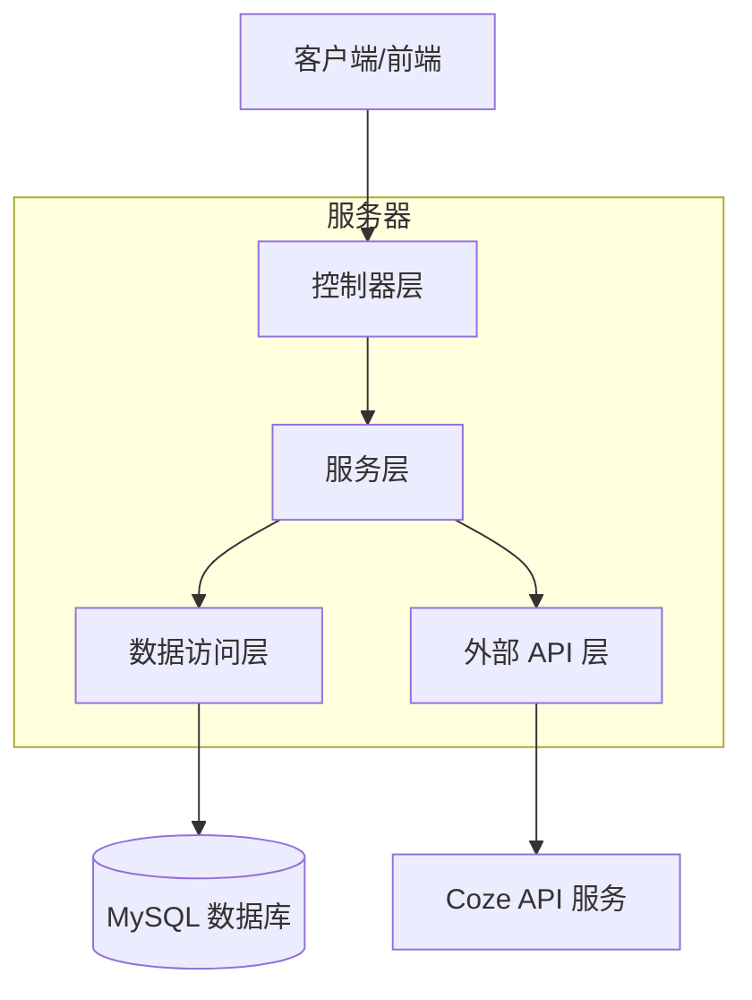
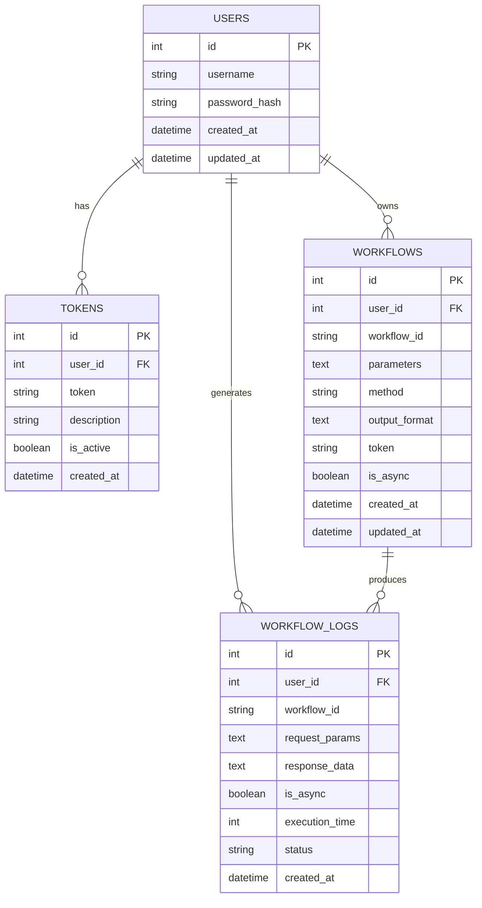

# Coze API 转换服务 - 技术架构文档

## 1. 架构设计



## 2. 技术描述

* **前端**：React\@18 + Ant Design\@5 + Axios + React Router\@6 + Vite

* **后端**：Node.js\@20 + Express\@4 + MySQL2 + jsonwebtoken + bcryptjs

* **数据库**：MySQL\@8.0

* **缓存**：Redis\@7.0

* **部署**：PM2 + Nginx + 宝塔面板

## 3. 路由定义

| 路由         | 用途                           |
| ---------- | ---------------------------- |
| /login     | 登录页面，用户身份验证                  |
| /dashboard | 仪表板页面，显示概览信息和快捷操作            |
| /profile   | 用户管理页面，个人信息和密码修改             |
| /tokens    | Token 管理页面，管理 Coze API Token |
| /workflows | 工作流配置页面，创建和管理工作流配置           |
| /api-test  | API 调用页面，测试工作流接口             |
| /logs      | 运行日志页面，查看工作流运行历史             |

## 4. API 定义

### 4.1 核心 API

**用户认证相关**

```
POST /api/auth/login
```

请求参数：

| 参数名      | 参数类型   | 是否必需 | 描述  |
| -------- | ------ | ---- | --- |
| username | string | true | 用户名 |
| password | string | true | 密码  |

响应参数：

| 参数名     | 参数类型    | 描述       |
| ------- | ------- | -------- |
| success | boolean | 请求是否成功   |
| token   | string  | JWT 认证令牌 |
| user    | object  | 用户信息     |

示例：

```json
{
  "username": "admin",
  "password": "123456"
}
```

**Token 管理相关**

```
GET /api/tokens
POST /api/tokens
DELETE /api/tokens/:id
```

**工作流配置相关**

```
GET /api/workflows
POST /api/workflows
PUT /api/workflows/:id
DELETE /api/workflows/:id
```

**工作流执行相关**

```
GET /api/execute/:workflowId
POST /api/execute/:workflowId
```

**日志查询相关**

```
GET /api/logs
GET /api/logs/:workflowId
```

## 5. 服务器架构图



## 6. 数据模型

### 6.1 数据模型定义



### 6.2 数据定义语言

**用户表 (users)**

```sql
-- 创建用户表
CREATE TABLE users (
    id INT AUTO_INCREMENT PRIMARY KEY,
    username VARCHAR(50) UNIQUE NOT NULL,
    password_hash VARCHAR(255) NOT NULL,
    created_at TIMESTAMP DEFAULT CURRENT_TIMESTAMP,
    updated_at TIMESTAMP DEFAULT CURRENT_TIMESTAMP ON UPDATE CURRENT_TIMESTAMP
);

-- 创建索引
CREATE INDEX idx_users_username ON users(username);
```

**Token 表 (tokens)**

```sql
-- 创建 Token 表
CREATE TABLE tokens (
    id INT AUTO_INCREMENT PRIMARY KEY,
    user_id INT NOT NULL,
    token VARCHAR(500) NOT NULL,
    description VARCHAR(200),
    is_active BOOLEAN DEFAULT TRUE,
    created_at TIMESTAMP DEFAULT CURRENT_TIMESTAMP,
    FOREIGN KEY (user_id) REFERENCES users(id) ON DELETE CASCADE
);

-- 创建索引
CREATE INDEX idx_tokens_user_id ON tokens(user_id);
CREATE INDEX idx_tokens_is_active ON tokens(is_active);
```

**工作流配置表 (workflows)**

```sql
-- 创建工作流配置表
CREATE TABLE workflows (
    id INT AUTO_INCREMENT PRIMARY KEY,
    user_id INT NOT NULL,
    workflow_id VARCHAR(100) NOT NULL,
    parameters TEXT,
    method ENUM('GET', 'POST') DEFAULT 'POST',
    output_format TEXT,
    token VARCHAR(500) NOT NULL,
    is_async BOOLEAN DEFAULT FALSE,
    created_at TIMESTAMP DEFAULT CURRENT_TIMESTAMP,
    updated_at TIMESTAMP DEFAULT CURRENT_TIMESTAMP ON UPDATE CURRENT_TIMESTAMP,
    FOREIGN KEY (user_id) REFERENCES users(id) ON DELETE CASCADE
);

-- 创建索引
CREATE INDEX idx_workflows_user_id ON workflows(user_id);
CREATE INDEX idx_workflows_workflow_id ON workflows(workflow_id);
```

**工作流运行日志表 (workflow\_logs)**

```sql
-- 创建工作流运行日志表
CREATE TABLE workflow_logs (
    id INT AUTO_INCREMENT PRIMARY KEY,
    user_id INT NOT NULL,
    workflow_id VARCHAR(100) NOT NULL,
    request_params TEXT,
    response_data TEXT,
    is_async BOOLEAN DEFAULT FALSE,
    execution_time INT DEFAULT 0,
    status ENUM('success', 'error', 'timeout') DEFAULT 'success',
    created_at TIMESTAMP DEFAULT CURRENT_TIMESTAMP,
    FOREIGN KEY (user_id) REFERENCES users(id) ON DELETE CASCADE
);

-- 创建索引
CREATE INDEX idx_workflow_logs_user_id ON workflow_logs(user_id);
CREATE INDEX idx_workflow_logs_workflow_id ON workflow_logs(workflow_id);
CREATE INDEX idx_workflow_logs_created_at ON workflow_logs(created_at DESC);

-- 创建定时清理 7 天前日志的事件
CREATE EVENT IF NOT EXISTS cleanup_old_logs
ON SCHEDULE EVERY 1 DAY
DO
DELETE FROM workflow_logs WHERE created_at < DATE_SUB(NOW(), INTERVAL 7 DAY);
```

**初始化数据**

```sql
-- 插入默认管理员用户
INSERT INTO users (username, password_hash) VALUES 
('admin', '$2b$10$rQZ9QmjQQm9QmjQQm9QmjOeKKKKKKKKKKKKKKKKKKKKKKKKKKKKKKK');

-- 插入示例 Token
INSERT INTO tokens (user_id, token, description) VALUES 
(1, 'pat_example_token_here', '示例 Coze API Token');
```

